# ChatGPT Free Reverse Proxy (Ubuntu X86_64 + Cloudflare Bypass)


무료 ChatGPT 웹을 Playwright로 자동화하여 OpenAI 호환 API로 제공하는 Proxy 서버입니다. (최신 `chatgpt.com` 도메인 및 UI 업데이트 대응 완료)


## 🌟 주요 기능
- **자동 로그인**: Email 및 Password를 통한 자동 로그인 지원 (Auth0 등 다양한 로그인 폼 대응)
- **최신 UI 완벽 호환**: 새로운 ChatGPT DOM 구조(#prompt-textarea 등) 완벽 대응
- **세션 자동 유지 (Keep-Alive)**: 30분 단위 백그라운드 새로고침 기능으로 Cloudflare 세션 만료 및 봇 차단 우회
- **자동 복구 (Auto-Recovery)**: 페이지 DOM을 찾을 수 없거나 세션이 해제된 경우 자동으로 페이지 새로고침 및 재로그인 시도
- **Streaming 응답 지원**: OpenAI API와 동일하게 `stream=true` 지원
- **시스템 호환성**: Ubuntu 24.04, 26.04 (X86_64) 환경 완벽 지원
- **OpenAI 호환 API**: `/v1/chat/completions` 완벽 호환 및 Swagger UI 제공 (`/docs`)

## 🏗️ 시스템 동작 구조 (Architecture)

본 시스템은 외부에서 OpenAI API 표준 규격으로 들어오는 요청을 가로채어, 실제 ChatGPT 웹페이지를 Playwright로 조종하여 응답을 스크래핑해 반환하는 방식으로 동작합니다.

```mermaid
sequenceDiagram
    participant Client as Client (cURL / App)
    participant FastAPI as FastAPI Server
    participant Playwright as Playwright (Browser)
    participant ChatGPT as chatgpt.com

    Client->>FastAPI: POST /v1/chat/completions
    FastAPI->>Playwright: send_message_and_stream(prompt)
    
    rect rgb(30, 30, 30)
    Note over Playwright,ChatGPT: Headless Browser Automation
    Playwright->>ChatGPT: DOM 검색 (#prompt-textarea)
    Playwright->>ChatGPT: 프롬프트 입력 및 전송
    ChatGPT-->>Playwright: 실시간 텍스트 생성 (Streaming)
    end
    
    Playwright-->>FastAPI: AsyncGenerator (Chunk 단위 반환)
    FastAPI-->>Client: Server-Sent Events (SSE) 응답 반환
```



## 🚀 Getting Started (시작하기)

### 1. 설치 및 환경 설정

먼저 프로젝트 저장소로 이동한 후 환경 변수를 설정합니다.

```bash
# 환경 변수 템플릿 복사
cp .env.example .env
```

`.env` 파일을 열고 본인의 ChatGPT 이메일과 비밀번호를 입력하세요.
```env
EMAIL=your-email@example.com
PASSWORD=your-password
PORT=8005
HEADLESS=true
```

### 2. 실행

Docker Compose를 사용하여 간편하게 서버를 빌드하고 실행합니다.

```bash
# 백그라운드 모드로 Docker 빌드 및 컨테이너 실행
docker-compose up --build -d
```
> **참고**: Playwright Chromium과 내부 종속성을 함께 설치하므로 최초 빌드 시 약간의 시간이 소요될 수 있습니다.

### 3. API 추론 테스트 (cURL)

서버가 정상적으로 구동되었다면, `curl`을 사용하여 OpenAI API 표준 규격으로 메시지 전송 테스트를 진행해 볼 수 있습니다. 
*(초기 기동 시 Playwright 브라우저 렌더링 및 자동 로그인 과정으로 인해 첫 요청은 20~30초 가량 소요될 수 있습니다.)*


**일반 요청 테스트:**
```bash
curl -X POST http://localhost:8005/v1/chat/completions \
  -H "Content-Type: application/json" \
  -d '{
    "model": "gpt-4o",
    "messages": [{"role": "user", "content": "안녕하세요, 지금 당신이 동작 중인지 확인하는 테스트 메시지입니다!"}],
    "stream": false
  }'
```

**스트리밍(Streaming) 요청 테스트:**
```bash
curl -X POST http://localhost:8005/v1/chat/completions \
  -H "Content-Type: application/json" \
  -d '{
    "model": "gpt-4o",
    "messages": [{"role": "user", "content": "1부터 10까지 천천히 세어주세요."}],
    "stream": true
  }'
```

---

## 🛠️ 트러블슈팅 (Troubleshooting)

### Cloudflare "잠시만 기다리십시오..." (Turnstile) 화면에서 멈출 경우
현재 환경(IP, Headless Browser)이 OpenAI 쪽 봇 방지 시스템에 차단된 경우, 프롬프트 입력창을 찾지 못하고 타임아웃(`Timeout 20000ms exceeded`)이 발생할 수 있습니다.
이 경우, 브라우저에 직접 접속하여 캡차(사람인지 확인)를 수동으로 한 번 풀어주면 문제가 해결됩니다.

**수동 우회 방법 (VNC 사용):**
1. **VNC Viewer**(TigerVNC, RealVNC 등) 프로그램을 설치합니다.
2. VNC 주소에 `127.0.0.1:7900`을 입력하고 연결합니다 (비밀번호 없음).
3. Docker 컨테이너 내부에서 실행 중인 Chromium 화면이 표시됩니다.
4. 화면에 나타난 Cloudflare "사람인지 확인" 체크박스를 마우스로 **직접 한 번 클릭**해 줍니다.
5. ChatGPT 프롬프트 화면으로 넘어가는 것을 확인한 후 VNC를 종료합니다.
6. 완료 후, 발급된 세션과 쿠키가 볼륨에 저장되므로 이후에는 정상적으로 API 호출이 가능합니다.
